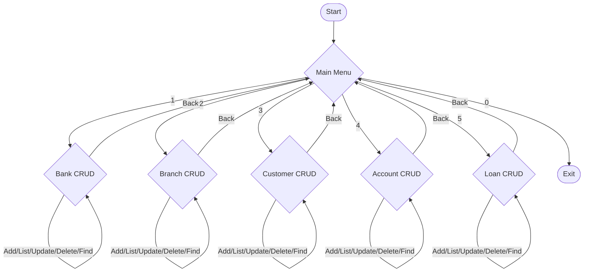

# Bank Management System - Flow Diagram

---

## Written Flow Explanation

1. **Start**: The application starts and initializes the main menu.
2. **Main Menu**: User is presented with options:
    - 1: Bank CRUD (Create, Read, Update, Delete)
    - 2: Branch CRUD
    - 3: Customer CRUD
    - 4: Account CRUD
    - 5: Loan CRUD
    - 0: Exit
3. **Bank CRUD**: User can add, list, update, delete, or find banks. After each operation, the user can go back to the main menu.
4. **Branch CRUD**: User can add (requires bank ID), list, update, delete, or find branches. After each operation, the user can go back to the main menu.
5. **Customer CRUD**: User can add (requires branch ID), list, update, delete, or find customers. After each operation, the user can go back to the main menu.
6. **Account CRUD**: User can add (requires branch ID, optional customer IDs), list, update balance, delete, or find accounts. After each operation, the user can go back to the main menu.
7. **Loan CRUD**: User can add (requires branch ID, account ID, optional customer IDs), list, update, delete, or find loans. After each operation, the user can go back to the main menu.
8. **Exit**: User can exit the application at any time from the main menu.

**Note:** Each CRUD menu allows the user to perform multiple operations in a loop until they choose to go back to the main menu. All data operations are handled via repository classes, and the application uses Hibernate for database interaction.